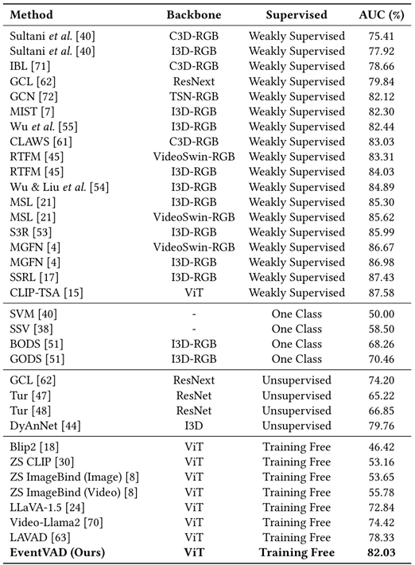
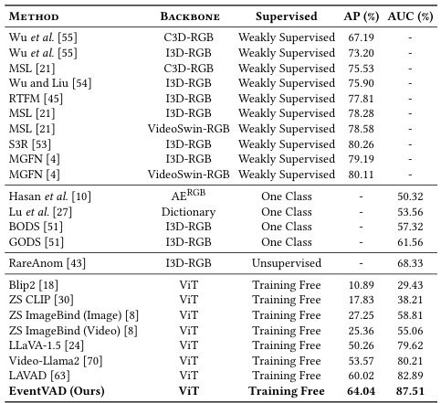

# EventVAD: Training-Free Event-Aware Video Anomaly Detection (Accepted by ACM Multimedia 2025)

<h5 align="center"> If our project helps you, please give us a star ⭐ on GitHub to support us. 🙏🙏 </h5>

## Datasets

This project uses the following datasets for evaluation:

- **UCF-Crime**: A large-scale dataset for real-world surveillance video anomaly detection, containing 1900 long untrimmed videos with 13 real-world anomalies.  
  [Download link](https://www.crcv.ucf.edu/projects/real-world/)

- **XD-Violence**: A large-scale audio-visual dataset for violence detection in videos, comprising 4754 untrimmed videos covering 6 categories of anomalies.  
  [Download link](https://roc-ng.github.io/XD-Violence/)

Place the datasets in the directories specified by the code (e.g., `src/event_seg/videos` for input videos).

## Installation

This project requires Python 3.10. It is recommended to use a virtual environment to manage dependencies.

1. Clone the repository:
   ```bash
   git clone https://github.com/YihuaJerry/EventVAD
   ```

2. Install the packages required for event splitting:
   ```bash
   conda create -n event_seg python=3.10
   conda activate event_seg
   cd src/event_seg
   pip install -r requirements.txt
   ```

3. Install the packages required for video scoring:
   ```bash
   conda create -n score python=3.10
   conda activate score
   cd src/score
   pip install -r requirements.txt
   ```

**Note**: Make sure to activate the virtual environment before installing dependencies. The 'evaluate.py' script relies on the library in 'score'.

## Usage

To run the entire pipeline, follow these steps:

1. **Event Segmentation**:
   - Navigate to the event segmentation directory:
     ```bash
     cd src/event_seg
     ```
   - Run the main script:
     ```bash
     conda activate event_seg
     python main.py
     ```

2. **Scoring**:
   - Navigate to the scoring directory:
     ```bash
     cd src/score
     ```
   - Run the scoring script:
     ```bash
     conda activate score
     python event_score.py
     ```

3. **Evaluation**:
   - Run the evaluation script:
     ```bash
     cd src
     conda activate score
     python evaluate.py
     ```

**Note**: Ensure that the UCF-Crime and XD-Violence datasets are prepared and placed in the appropriate directories (e.g., `src/event_seg/videos` for input videos).

## Main Results
### UCF-Crime
<p></p>

### XD-Violence
<p></p>

## 📑 Citation

If you use this code or the EventVAD method in your research, please cite the following paper:

```bibtex
@article{shao2025eventvad,
  title={Eventvad: Training-free event-aware video anomaly detection},
  author={Shao, Yihua and He, Haojin and Li, Sijie and Chen, Siyu and Long, Xinwei and Zeng, Fanhu and Fan, Yuxuan and Zhang, Muyang and Yan, Ziyang and Ma, Ao and others},
  journal={arXiv preprint arXiv:2504.13092},
  year={2025}
}
```
